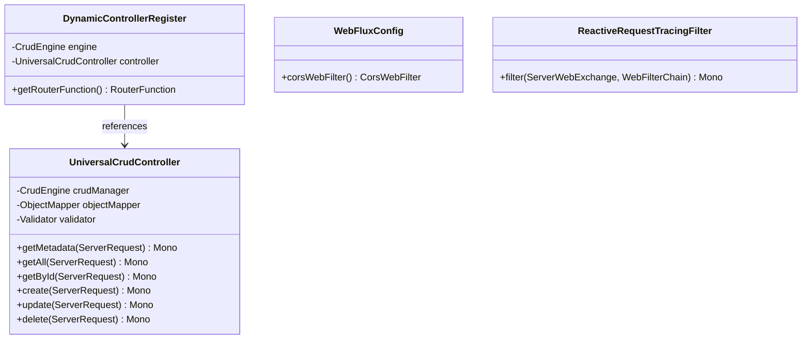
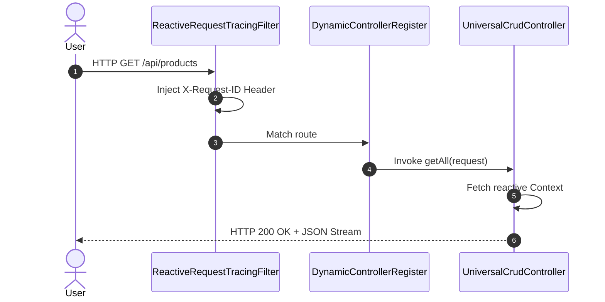

# WebFlux Routing Module Architecture (Mermaid)

This file contains Mermaid diagrams visualizing the structure and design of the WebFlux routing module (`crud-engine-webflux`).

## 1. Class Structure

## 2. Reactive Request Lifecycle

